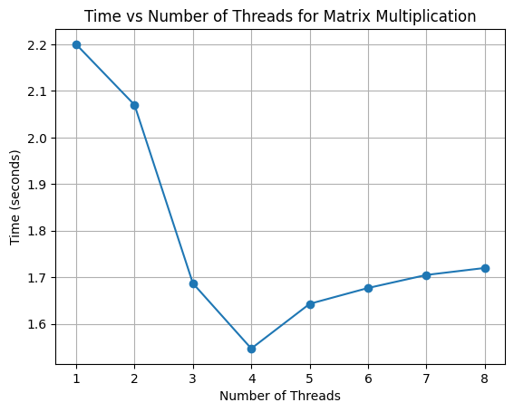
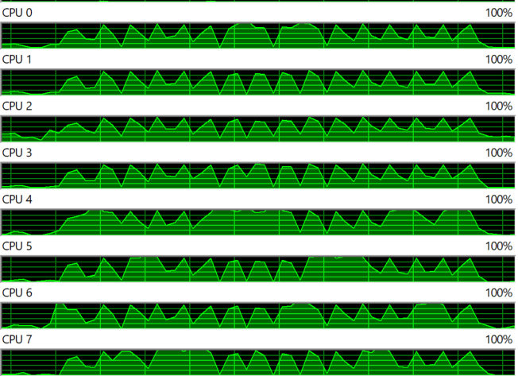

# Matrix Multiplication with Multithreading

This Python script performs matrix multiplication using multithreading and measures the time taken for different numbers of threads.

## Usage

To run the script, make sure you have Python installed. Then, simply execute the script:

-Multithreading.py

## Time taken(seconds) v/s no. of Threads:

| Thread 1 | Thread 2 | Thread 3 | Thread 4 | Thread 5 | Thread 6 | Thread 7 | Thread 8 |
|----------|----------|----------|----------|----------|----------|----------|----------|
| 2.20     | 2.07     | 1.687    | 1.547    | 1.643    | 1.677    | 1.705    | 1.72     |

## Resource Usage

